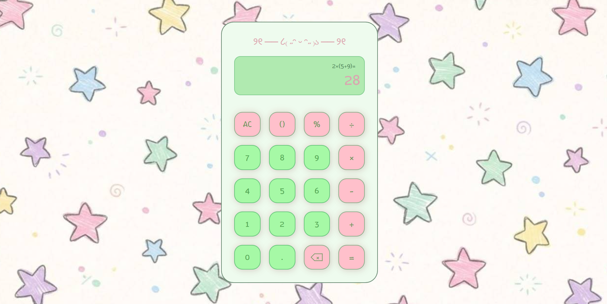

# 🎀🍀 Cute Calculator

### ｡･:*˚:✧｡ A tiny calculator with a cute little personality ｡･:*˚:✧｡

 

**HTML · CSS · JavaScript**

---

## 🧁 About

A cute and playful calculator made with **HTML, CSS & JavaScript**.
I wanted to turn a simple calculator into something a little more fun, with a soft **pink & green** color palette and a cozy anime-inspired feeling.

## 🍓 Features

| 🌷 | Feature                                          |
| -- | ------------------------------------------------ |
| 🍰 | Basic arithmetic operations                      |
| 🥝 | Addition, subtraction, multiplication & division |
| 🎐 | Percentage calculations                          |
| 🫧 | Decimal numbers                                  |
| 🐇 | Brackets `()`                                    |
| 🧸 | Backspace & AC buttons                           |
| ✨  | Interactive button animations                    |
| 🍃 | Cute pink & green interface                      |

## 🎨 Built With

**HTML**　♡　**CSS**　♡　**JavaScript**

## 📝 What I Practiced

This project helped me practice:

* JavaScript functions & logic
* DOM manipulation
* Event listeners
* Handling user input
* CSS Grid
* CSS animations & transitions
* Creating a themed user interface

---

### ૮ ˶ᵔ ᵕ ᵔ˶ ა

**Thanks for stopping by!**

`made with ♡, code & a little bit of pink`

